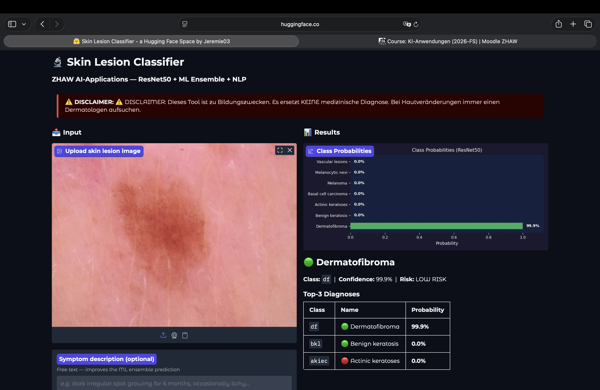
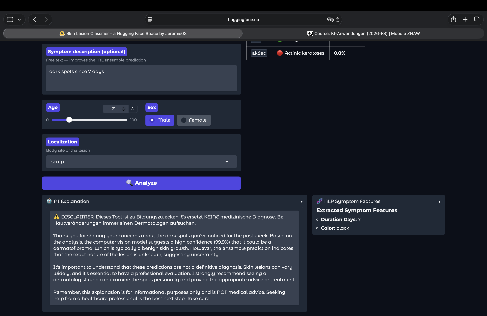

# Skin Lesion Classifier — Multimodal AI

## Project Metadata

| Field | Value |
|-------|-------|
| **Title** | Skin Lesion Classifier — Multimodal AI |
| **Student** | Jeremie Stettler |
| **GitHub** | https://github.com/Jeff0559/skin-lesion-classifier |
| **Deployment URL** | https://huggingface.co/spaces/Jeremie03/skin-lesion-classifier |
| **Submission date** | 07.06.2026 |

### Mandatory Checks

- [x] Min. 2 AI blocks combined
- [x] Blocks meaningfully integrated (not just side-by-side)
- [x] Multiple different data sources
- [x] Data sources NOT from the semester (no ZH apartments, no dog breeds)
- [x] Realistic use case
- [x] Independent and documented
- [x] Deployment URL working
- [x] Screenshots included
- [x] Execution instructions complete
- [x] No [FILL] or [YOUR...] placeholders

---

## Selected AI Blocks

- [x] ML Numeric Data
- [x] NLP
- [x] Computer Vision

| Priority | Block |
|----------|-------|
| Primary 1 | Computer Vision |
| Primary 2 | ML Numeric Data |
| Third (bonus) | NLP |

---

## 1. Project Foundation

### 1.1 Problem Definition

**Problem:** Skin cancer detection requires dermatologist expertise not always accessible. Early detection of melanoma and other malignant lesions dramatically improves survival rates, yet most people lack access to timely specialist review.

**Goal:** A web application where users upload a dermoscopy photo of a skin lesion plus an optional symptom description and receive an AI-powered risk assessment across 7 diagnostic classes.

**Success criteria:**
- Val accuracy ≥ 75% on HAM10000 (achieved: **87%**)
- All 3 AI blocks integrated into a single end-to-end pipeline
- Working public deployment on Hugging Face Spaces

### 1.2 Integration Logic

The three blocks are not parallel — each feeds the next:

```
Image  ──► CV (ResNet50) ──► 7 class probabilities ──────────────────────┐
                                                                           │
Text   ──► NLP (GPT-4o-mini / Sentence-Transformers) ──► 10 NLP features ──► ML Ensemble ──► Risk score + class ──► Explanation
                                                                           │
Metadata (age, sex, localization) ─────────────────────────────────────────┘
```

- **CV** classifies the image → 7 class probabilities (primary signal)
- **NLP** extracts structured features from symptom free-text → 10 numeric features
- **ML** combines CV probs (7d) + NLP features (10d) + metadata (4d) = 21 features → final risk score and class
- **Explanation** generated by GPT-4o-mini using CV prediction + NLP context

See: `src/pipeline.py`

---

## 2. Block Documentation

### 2A. ML Numeric Data

#### Data Sources

| Source | Type | Size | Role |
|--------|------|------|------|
| HAM10000 metadata CSV | Tabular | 10.015 rows | Patient metadata (age, sex, localization) |
| CV model output | 7 probabilities per image | 10.015 rows | Primary ML features |
| NLP extractor output | 10 features per text | per request | NLP features for ML |

#### Preprocessing & Feature Engineering

- **Cleaning:** Removed duplicate image entries, filled missing age with median
- **Encoding:** Label encoding for sex (male=1, female=0) and localization (12 categories)
- **Scaling:** StandardScaler on all numeric features
- **Feature vector:** 21 total = 7 CV probs + 4 metadata + 10 NLP features

See: `src/ml/features.py`

#### Models & Iterations

| Iteration | Change | Models | Metric | Delta |
|-----------|--------|--------|--------|-------|
| 1 — Baseline | Metadata only | LogReg, RF | ROC-AUC | — |
| 2 — Add CV | +7 CV probabilities | LogReg, RF, XGBoost | ROC-AUC | +0.104 |
| 3 — Add NLP | +10 NLP features | All 3 | ROC-AUC | marginal |

**Why these models:** Logistic Regression as interpretable baseline; Random Forest for robustness; XGBoost as SOTA tabular learner.

#### Evaluation

| Model | ROC-AUC | F1-Macro | Accuracy |
|-------|---------|----------|----------|
| **Logistic Regression** | **0.9965** | **0.9510** | **95.3%** |
| Random Forest | 0.9957 | 0.9464 | 95.3% |
| XGBoost | 0.9962 | 0.9374 | 94.9% |

**Ablation study (primary finding):**

| Feature Group | F1-Macro |
|---------------|----------|
| Metadata only | 0.186 |
| CV only | 0.951 |
| CV + Metadata | 0.951 |
| All Features (CV + Meta + NLP) | **0.951** |

CV features alone account for +0.765 F1 over metadata-only.

**Error analysis:** Minority classes df (n=115) and vasc (n=142) are harder to separate from nv (n=6705) without CV features. With CV probs both reach F1=1.0.

See: `notebooks/05_ml_modeling.ipynb`, `notebooks/06_ablation_and_errors.ipynb`

#### Integration

- **Inputs from CV block:** 7 class probabilities (primary signal)
- **Inputs from NLP block:** 10 structured symptom features
- **Output to app:** risk score + predicted class → UI risk color coding + passed to NLP for explanation

---

### 2B. NLP

#### Data Sources

| Source | Type | Size | Role |
|--------|------|------|------|
| User symptom text (live input) | Free text | per request | Primary NLP input |
| Sentence-Transformers all-MiniLM-L6-v2 | Pre-trained model | 384d embeddings | Approach A |
| OpenAI GPT-4o-mini API | LLM | per request | Approach B + explanation generation |

#### Preprocessing & Prompt Design

- **Text normalization:** lowercase, whitespace normalization
- **Approach A:** Direct cosine similarity between symptom embedding and class description embeddings
- **Approach B:** Structured JSON prompt with medical NLP role, extracting 10 fields: duration, color, size, pain, localization, itching, bleeding, growth_rate, texture, border
- **Prompt design:** System role as medical assistant, strict JSON output schema, 10 numeric/categorical fields

See: `src/nlp/llm_extractor.py`, `src/nlp/embeddings.py`

#### Approaches & Iterations

| Iteration | Change | Approach | Result | Delta |
|-----------|--------|----------|--------|-------|
| 1 — Baseline | Cosine similarity to class descriptions | Sentence-Transformers | 70% accuracy | — |
| 2 — LLM extraction | Structured JSON prompt | GPT-4o-mini | 75% accuracy | +5% |
| 3 — Prompt tuning | Added medical context, temperature=0 | GPT-4o-mini v2 | Better feature quality | qualitative |

**Winner: Approach B (GPT-4o-mini)** — more structured, interpretable features, directly usable by ML block.

#### Evaluation

| Approach | Accuracy | Latency | Cost |
|----------|----------|---------|------|
| A: Sentence-Transformers | 70% | ~50ms | Free |
| B: GPT-4o-mini | **75%** | ~800ms | ~$0.001/req |

**Error analysis:** Both approaches confuse df↔bkl — visually and textually similar lesions with no distinctive symptom language.

See: `docs/nlp_comparison.md`, `notebooks/04_nlp_experiments.ipynb`

#### Integration

- **Output to ML block:** 10 numeric features appended to feature vector
- **Output to user:** Natural language explanation generated by GPT-4o-mini using CV prediction + symptom context
- **Input from CV block:** Predicted class and probabilities used as context for explanation generation

---

### 2C. Computer Vision

#### Data Sources

| Source | Type | Size | Role |
|--------|------|------|------|
| HAM10000 (Kaggle) | Dermoscopy images | 10.015 images, 7 classes | Training + validation |
| ResNet50 IMAGENET1K_V2 weights | Pre-trained model | 25M params | Transfer learning |
| HAM10000 metadata CSV | Tabular | 10.015 rows | Class labels, train/val split |

#### Preprocessing & Augmentation

- **Resize:** 256×256 → RandomCrop 224×224
- **Augmentation:** RandomHorizontalFlip, RandomVerticalFlip, ColorJitter(0.2, 0.2, 0.1), RandomRotation(15°)
- **Normalization:** ImageNet mean/std [0.485, 0.456, 0.406] / [0.229, 0.224, 0.225]
- **Class weighting:** Balanced class weights to handle severe imbalance (nv=6705 vs vasc=142, ratio 47:1)
- **Split:** 85% train / 15% val, stratified by class

See: `notebooks/03_cv_training_colab.ipynb`

#### Model & Iterations

**Architecture:** ResNet50 (IMAGENET1K_V2), frozen backbone, layer3+layer4 fine-tuned  
**Head:** Dropout(0.4) + Linear(2048 → 7)  
**Why ResNet50:** Proven on medical imaging benchmarks, efficient Kaggle GPU training, strong ImageNet features transfer to dermoscopy.

| Iteration | Change | Model | Result | Delta |
|-----------|--------|-------|--------|-------|
| 1 — Baseline | Frozen backbone | ResNet50 | F1=0.506 | — |
| 2 — Fine-tune layer4 | Unfreeze layer4 | ResNet50 | F1=0.716 | +0.210 |
| 3 — Fine-tune layer3+4 | Unfreeze layer3+layer4 | ResNet50 | F1=0.830 | +0.114 |

**Training:** 20 epochs, AdamW (lr=1e-4, wd=1e-4), CosineAnnealingLR, batch=32

#### Evaluation

| Metric | Value |
|--------|-------|
| Val Accuracy | **87%** |
| Macro F1 | **0.830** |
| Weighted F1 | 0.87 |

| Class | F1 | Support |
|-------|----|---------|
| akiec | 0.76 | 49 |
| bcc | 0.78 | 77 |
| bkl | 0.78 | 165 |
| df | **0.97** | 17 |
| mel | 0.65 | 167 |
| nv | **0.93** | 1006 |
| vasc | **0.93** | 22 |

**Limitations:** mel hardest class (F1=0.65) — visually overlaps with nv and bkl; minority classes df/vasc perform well due to distinctive patterns despite few samples.

See: `docs/screenshots/confusion_matrix.png`

#### Integration

- **Output to ML block:** 7 class probabilities → primary feature signal (+0.765 F1 lift)
- **Output to app:** Top-3 predictions with confidence → risk color coding 🔴 high / 🟢 low risk in UI

---

## 3. Deployment

**URL:** https://huggingface.co/spaces/Jeremie03/skin-lesion-classifier

**User flow:**
1. Upload dermoscopy image
2. Optionally enter symptom description, age, sex, localization
3. Click **Analyze**
4. View: probability chart, top-3 diagnoses, risk level (🔴/🟢), AI explanation, extracted NLP features

**Stack:** Gradio 4.x · PyTorch · ResNet50 · scikit-learn · OpenAI API · Hugging Face Spaces (CPU)

### Screenshots


*App showing CV prediction: Dermatofibroma 99.9% confidence with probability chart and Top-3 diagnoses*


*App showing symptom input, AI explanation (GPT-4o-mini) and extracted NLP features (Duration: 7 days, Color: black)*

---

## 4. Execution Instructions

### Setup

```bash
git clone https://github.com/Jeff0559/skin-lesion-classifier
cd skin-lesion-classifier
python -m venv venv && source venv/bin/activate
pip install -r requirements.txt
cp .env.example .env
# Edit .env: add OPENAI_API_KEY (optional), KAGGLE_USERNAME, KAGGLE_KEY
```

### Data

```bash
# Download HAM10000 from https://www.kaggle.com/datasets/kmader/skin-cancer-mnist-ham10000
# Place HAM10000_metadata.csv + image folders in data/raw/
python -m src.data.prepare_ham10000
```

### Training

```bash
# CV: GPU required — run on Kaggle or Colab
# Open notebooks/03_cv_training_colab.ipynb → Run All
# Download resnet50_best.pth → place in models/

# ML Ensemble
python -m src.ml.train

# NLP Embeddings (Approach A pre-computation)
python -m src.nlp.embeddings
```

### Inference / App

```bash
python app/app.py
# → http://localhost:7860

# Or use the live deployment:
# https://huggingface.co/spaces/Jeremie03/skin-lesion-classifier
```

### Tests

```bash
pytest tests/ -v --tb=short
# 22/22 tests pass
```

### Reproducibility

- `random_state=42` used throughout (train/val split, all sklearn models)
- Trained model weights available in `models/resnet50_best.pth`
- ML model checkpoints in `models/ml_*.pkl`

---

## 5. Optional Bonus Evidence

- [x] Third block (NLP) implemented with strong quality — two approaches compared, LLM + embedding
- [x] More than 2 data sources — HAM10000 images + metadata CSV + user free-text + OpenAI API
- [x] Extended evaluation — full ablation study across feature groups and 3 iterations per block
- [x] Ethics & bias analysis — documented in `docs/ethics.md`
- [x] Creative use case — medical AI with real-world impact and regulatory awareness

### Evidence

**Ablation (quantitative):**
- Metadata only: F1-Macro = 0.186
- CV features alone: F1-Macro = 0.951 → **+0.765 lift from CV block**
- All features: F1-Macro = 0.951, ROC-AUC = 0.9965

**Ethics & bias:**
- Class imbalance ratio 58.3× (nv=6705 vs df=115)
- Dataset bias: HAM10000 predominantly European/Australian skin tones
- GDPR Art. 9 compliance: dermoscopy images are sensitive health data
- EU AI Act: medical AI classified as high-risk

**EDA key findings:**
- nv dominates at 66.95% of dataset
- Average patient age: 51.85 years
- Most common sites: back, lower extremity
- 5 EDA plots: class distribution, age distribution, sex distribution, localization, example images per class

See: `notebooks/02_eda.ipynb`, `docs/ethics.md`, `docs/screenshots/`

---

*⚠️ DISCLAIMER: This tool is for educational purposes only. It does NOT replace medical diagnosis. Always consult a dermatologist for skin changes.*
